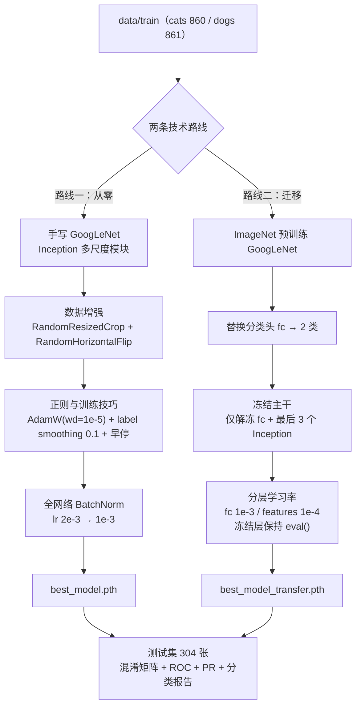

# GoogLeNet 猫狗分类：从零训练 vs 迁移学习

1721 张猫狗照片上的一组对照实验：手写 GoogLeNet（Inception 多尺度模块）从零训练得到 82.24%，改用 ImageNet 预训练权重后得到 97.04%，误判样本由 54 张减至 9 张。两组实验的唯一区别是特征提取器的初始化方式。

本仓库已归档，不再更新。`tools/` 下的两个数据管线脚本（分层划分、IQR 剔除异常后统计 `mean/std`）可以独立复用，模型部分用于验证这两个脚本。

> 9 条已知限制见「已知限制」一节。其中第 5、6 条说明了为什么 82.24% 这个数字不能直接作为结论引用。


迁移版在测试集（304 张）上的输出：混淆矩阵 + ROC + PR 三子图，仅 9 张误判，两条曲线紧贴左上角。

> **关于这两个数字**：从零版的 82.24% 是 `result/model_test.png` 这一次运行的记录；仓库中现存的 `best_model.pth` 已被后续重跑覆盖，用它重算得 82.57%（错误较多的类别也从"猫"变成"狗"）。详见「已知限制」第 6 条。

---

## 解决什么问题

手里只有**一千多张**猫狗照片，却想训一个像 GoogLeNet 这样有几百万参数的深度网络。

这是小数据场景的典型困境：模型容量远大于数据量，从随机初始化开始训练时，模型并非学不会，而是会记住训练集——训练损失持续下降，验证指标早早停滞，两者之间出现明显间隙（见基线训练曲线 `result/model_control_train.png`）。

所以真正想回答的问题不是"GoogLeNet 能不能做猫狗分类"，而是：

1. 在这个数据量下，从零训练的上限在哪？各种调参手段（数据增强、正则、BatchNorm）能把它抬到多高？
2. 如果换成迁移学习，能好多少？这个差距值不值得付出"改用预训练范式"的代价？

为了让结论站得住，我没有只跑一个模型，而是把两条路线放在**同一份数据、同一个测试集、同一套评估指标**下做对照，并且把每一次调整都落成一次独立的 Git 提交，方便回看"改了什么、为什么改、涨了多少"。

---

## 我的做法



每一步都是针对上一步暴露的问题做的，对应 6 个训练路线提交（另有 `a38f57f` 只新增了 `tools/` 与文档，不属于训练阶段）：

| 提交 | 做了什么 | 为什么这么选 |
|------|----------|--------------|
| `197f95c` init | 手写 GoogLeNet（Inception 多尺度模块）、Adam lr=2e-3、Dropout(0.5)、无任何增强 | 先要一个**可控的对照基线**：经典架构 + 最朴素配置，后面每一次改动才有比较对象。Inception 用 4 条并行支路（1×1、1×1+3×3、1×1+5×5、池化+1×1）在通道维拼接，用多尺度特征替代单一大卷积，参数更省 |
| `c431283` 优化1 | 训练集加增强（`RandomResizedCrop(scale=(0.8,1.0))` + 水平翻转 + ColorJitter）；换 AdamW(wd=1e-4)；`label_smoothing=0.1`；`ReduceLROnPlateau` + EarlyStopping；固定 seed(42) 切分 | 小数据过拟合，**增强是性价比最高的手段**——不增加真实样本就扩充了输入分布多样性。验证集**不做增强**，否则评估分布被扭曲。AdamW 把权重衰减从梯度更新里解耦；标签平滑抑制过度自信 |
| `f4e1db0` 优化2 | 撤掉 Dropout(0.5)、关闭 ColorJitter、weight_decay 1e-4 → 1e-5 | 优化1 一次性改了 5 个变量（增强 / AdamW / weight_decay / label smoothing / 早停），**无法归因**。当时判断是正则叠得太重，于是做反向"松绑"：保留几何增强和标签平滑，撤掉最激进的几味药。后续复核认为真正欠缺的其实是训练预算（每 epoch 仅 11 个梯度步），见「已知限制」第 5 条 |
| `30e8fad` 优化3 | 每个卷积后加 `BatchNorm2d`（Conv→BN→ReLU），lr 2e-3 → 1e-3 | BN 修正内部协变量偏移，让损失曲线平滑、训练稳定；加 BN 后梯度尺度变了，先用更保守的步长跑，避免初期抖动。**这是从零版唯一的转折点**（val acc 从 ≈0.68 抬到 ≈0.88） |
| `4b6b009` 优化4 | 迁移学习：加载 ImageNet 预训练 GoogLeNet，换 `fc` 为 2 类，全冻结 → 解冻 fc + 最后 3 个 Inception，分层学习率 | 从零版调了三轮仍在 82% 附近徘徊，说明在现有训练预算下已到瓶颈。迁移学习直接继承"边缘→纹理→部件"的通用视觉特征，只需对齐"猫狗"这层薄语义；底层不动、只训高层，既快又不易过拟合 |
| `d851700` 优化5 | 测试脚本输出混淆矩阵 + ROC + PR 三子图，并打印 Precision/Recall/F1 | **准确率会骗人**：当次运行的 82.24% 看起来还行，混淆矩阵才暴露出猫的召回只有 0.776。ROC/PR 是阈值无关的排序质量指标，对二分类小测试集更诚实 |

---

## 结果

测试集共 304 张（cats 152 / dogs 152），两方案用同一份数据评估：

| 方案 | 测试准确率 | cats F1 | dogs F1 | 误判张数 |
|------|-----------|---------|---------|----------|
| 从零手写 GoogLeNet（最终版） | 0.8224 | 0.8138 | 0.8302 | 54 |
| ImageNet 迁移学习 | **0.9704** | **0.9711** | **0.9697** | **9** |
| 差值 | **+0.1480（+14.8 个百分点，相对提升约 18%）** | +0.1573 | +0.1395 | **-45（-83%）** |

> 表中指标均由 `result/model_test.png`、`result/model_transfer_test.png` 中的显式混淆矩阵反算得出，可逐项复算。

错在哪，比错多少更重要：

- **从零版**（`result/model_test.png`，正类 = cats）：152 张真猫里 34 张被判成狗，猫的召回只有 **0.776**；152 张真狗里 20 张被判成猫。瓶颈是**猫的召回**。
- **迁移版**（`result/model_transfer_test.png`）：只错 9 张——**8 张狗误报为猫（FP = 8）、1 张猫漏判为狗（FN = 1）**，两类召回均 **>0.94**。

训练过程的证据链也在 `result/`：`model_control_train.png`（基线，训练/验证间隙明显 → 过拟合）→ `model1_train.png`（增强后 train/val 同时塌到接近随机）→ `model2_train.png`（松绑正则后略有回升）→ `model3.train.png`（加 BN 后曲线平滑，train acc 冲到 1.0、val ≈0.88）→ `model4_train.png`（迁移版损失快速下降、验证准确率高位）。

**一句话结论**：从零版靠调参（增强 + 松绑正则 + BN）从"接近随机"救到了 82% 附近，但在这套训练预算（每 epoch 仅 11 个梯度步）下**远未收敛**；换成迁移学习后直接到 97%。因此当前证据支持的是"**小数据 + 从零训练 + 现有预算** 明显不如迁移学习"，而**不是**"82% 是从零路线的数据规模上限"——要谈上限，必须先把训练预算给够再重跑一次。

> 测试集每类仅 152 张，绝对数值有统计波动，结论以两方案的**相对差距**为准。

---

## 快速开始

```bash
python tools/split_dataset.py --data_dir ./data   # 1. 把 data/cats、data/dogs 划分成 train/test 结构
python train_transfer.py                          # 2. 迁移训练 → best_model_transfer.pth
python model_test_transfer.py                     # 3. 测试并出图 → result/model_transfer_test.png
```

- 第 1 步只在数据是「按类别分文件夹」的原始目录时需要；已经是 `data/train/{cats,dogs}` 结构可跳过。
- 跑从零路线：`python model_train.py` → `python model_test.py`（产物 `best_model.pth`、`result/model_test.png`）。
- 测试脚本默认**弹窗**显示图片并落盘；服务器/容器里用 `MPLBACKEND=Agg python model_test_transfer.py` 只保存不弹窗。
- `data/` 与 `*.pth` 被 `.gitignore` 排除，需自行准备猫狗图片放入 `data/train/{cats,dogs}`、`data/test/{cats,dogs}`。

---

## 环境依赖

- **Python 3.10+**（建议使用 Anaconda 环境 `pytorch`）
- `torch` / `torchvision` / `matplotlib` / `numpy`
- `pandas`（训练脚本用于组织逐 epoch 曲线数据）
- `scikit-learn`（测试脚本的混淆矩阵 / ROC / PR / 分类报告）
- `torchsummary`（`model.py` 的 `__main__` 里打印网络结构）

如使用 Anaconda，可创建并激活环境后安装依赖：

```bash
conda create -n pytorch python=3.10
conda activate pytorch
conda install pytorch torchvision torchaudio cpuonly   # 或按 CUDA 版本安装
pip install matplotlib numpy pandas scikit-learn torchsummary
```

> **为什么要求 3.10+**：`tools/` 下的两个工具使用了 PEP 604 的联合类型写法（`list[tuple[str, float]] | None`、`int | None`）且未加 `from __future__ import annotations`，在 Python 3.9 下会直接抛 `TypeError`。若必须停留在 3.9，可在这两个文件顶部补上 `from __future__ import annotations`。
>
> `torchsummary` 已停止维护，可平滑替换为同接口的 `torchinfo`。
>
> `tools/` 下的两个工具不依赖 torch：`split_dataset.py` 仅用 Python 标准库，`compute_mean_std.py` 仅需 `numpy` + `Pillow`。
>
> 也可以一步到位：`pip install -r requirements.txt`。清单中的版本号取自本项目实际使用的环境（**Python 3.10.19 + torch 2.9.0**）；`torch` / `torchvision` 建议按平台单独安装（CPU 或对应 CUDA 构建），见该文件内注释。

---

## 数据准备

### 数据来源

| 项目 | 说明 |
|---|---|
| 数据集名称 | **Cat and Dog**（Cats and Dogs dataset to train a DL model） |
| 来源 | Kaggle：<https://www.kaggle.com/datasets/tongpython/cat-and-dog> |
| 原始结构 | `training_set/{cats,dogs}` + `test_set/{cats,dogs}` |
| 页面标注规模 | 约 10.0k 个文件 / 228.46 MB（Version 1） |
| 许可证 | **CC0: Public Domain**（Kaggle 页面标注） |
| 本项目实际使用 | 上述数据集的一个子集，本地清洗后组织为 `data/train` + `data/test` |

> **引用与合规**：对外提交或发表时请写明数据集名称、Kaggle 链接与访问日期。Kaggle 页面标注为 CC0（公有领域），但该页面是上游猫狗数据集的再分发版本；若用于正式发表，建议再核对一次上游原始条款。
>
> **本项目子集的口径**：本地 `data/` 共 **2025 张**（远少于原始 10.0k），挑选/去重的具体过程没有留下记录——这也是"数据规模"相关结论（见「已知限制」第 5 条）需要谨慎表述的原因之一。

### 目录结构

数据按 PyTorch `ImageFolder` 结构组织（本项目实测规模：训练集 1721 张、测试集 304 张，合计 2025 张）：

```
data/
├── train/
│   ├── cats/   *.jpg   （860 张）
│   └── dogs/   *.jpg   （861 张）
└── test/
    ├── cats/   *.jpg   （152 张）
    └── dogs/   *.jpg   （152 张）
```

若手头是 `data/cats`、`data/dogs` 这类「按类别分文件夹」的原始目录，可用 `tools/split_dataset.py` 一键划分为上面的 `train/test` 结构（详见「辅助工具」章节）。

> **注意**：`data/` 目录与训练得到的权重文件（`best_model.pth`、`best_model_transfer.pth`）由 `.gitignore` 排除，**不纳入版本库**。请自行准备猫狗图片并放入上述目录结构后运行。

---

## 辅助工具

`tools/` 下提供两个可独立使用的工具，也可 `from split_dataset import ...` 在代码中复用。

### split_dataset.py — 数据集划分

把「按类别分文件夹」的图片按**分层抽样**重新组织为 `data/{train,test}/<class>/`，默认 **train 85% / test 15%**，固定随机种子可复现。

```powershell
# 在项目根目录执行
python tools/split_dataset.py --data_dir ./data            # 默认 85%/15%，移动模式（原地重组织）
python tools/split_dataset.py --data_dir ./data --copy     # 复制模式，保留原始目录
python tools/split_dataset.py --data_dir ./data --ratios 0.8 0.2 --seed 42
```

| 参数 | 默认值 | 说明 |
|---|---|---|
| `--data_dir` | `./data` | 数据集根目录，其每个子文件夹视为一个类别。 |
| `--ratios` | `0.85 0.15` | 训练/测试比例，两值之和须为 1。 |
| `--seed` | `42` | 随机种子，固定后划分可复现。 |
| `--copy` | 关闭 | 复制而非移动，保留原图。 |

> 若 `data/` 下已存在 `train` / `test` 目录，脚本会报错退出，避免重复划分破坏数据。

### compute_mean_std.py — 归一化参数统计

用 **IQR 四分位距**自动识别并剔除异常图片后，计算数据集逐通道 mean / std，可直接作为 `transforms.Normalize(mean, std)` 参数。**从零版使用的归一化常数即由此工具计算得到**。

```powershell
python tools/compute_mean_std.py --data_dir ./data
python tools/compute_mean_std.py --data_dir ./data --image_size 224 --iqr_k 1.5
```

输出示例：

```
==== 数据集均值/标准差统计 ====
图片总数    : 2025
异常剔除    : 42
  通道 0: mean = 0.481451   std = 0.256604
  通道 1: mean = 0.447649   std = 0.247922
  通道 2: mean = 0.407904   std = 0.250483

Normalize 可用参数：
  mean = [0.481451, 0.447649, 0.407904]
  std  = [0.256604, 0.247922, 0.250483]
```

| 参数 | 默认值 | 说明 |
|---|---|---|
| `--data_dir` | 脚本同级 `data/` | 图片根目录（可含类别子目录）。 |
| `--iqr_k` | `1.5` | IQR 倍数，`k` 越大越宽松、剔除越少。 |
| `--image_size` | `224` | Resize 边长，需与训练 `transforms.Resize` 一致；`0` 用原图。 |
| `--force_channels` | 自动 | 强制通道数：`1` 灰度 / `3` RGB。 |
| `--no_recursive` | 关闭 | 只扫描 `data_dir` 下一级。 |

> 该统计是在 `data/` **全量（train + test）** 上做的（默认递归扫描），因此从零版的归一化常数含有一点测试集信息——低维统计量，影响很小，但严格做法是只用 `data/train` 统计，详见「已知限制」第 3 条。
>
> 迁移学习版**不使用**该统计值，而是采用 **ImageNet 常数**归一化，以匹配预训练权重的输入分布。

两工具的完整参数、原理与常见问题，见 `tools/split_dataset_README.md` 与 `tools/compute_mean_std_README.md`。

---

## 使用说明

在仓库根目录下执行：

| 目的 | 命令 | 产物 |
|------|------|------|
| 从零训练 | `python model_train.py` | 权重 `best_model.pth` + 曲线 `result/curve_scratch.png` |
| 迁移训练 | `python train_transfer.py` | 权重 `best_model_transfer.pth` + 曲线 `result/curve_transfer.png` |
| 从零测试 | `python model_test.py` | `result/model_test.png`（弹窗 + 落盘） |
| 迁移测试 | `python model_test_transfer.py` | `result/model_transfer_test.png`（弹窗 + 落盘） |

> 测试脚本运行结束会**直接弹窗**显示可视化结果；在无图形界面的环境（服务器 / 容器）运行时，可临时设置 `MPLBACKEND=Agg` 跳过弹窗、仅保存图片（无需改代码）：
> ```bash
> MPLBACKEND=Agg python model_test.py
> ```

---

## 项目结构

```
GoogLeNet-scratch-vs-transfer/
├── model.py                 # 从零版网络：手写 Inception 多尺度模块 + GoogLeNet
├── model_train.py           # 从零版训练（增强 / AdamW / 早停 / 学习率调度）
├── model_test.py            # 从零版测试：混淆矩阵 + ROC + PR + 分类报告
├── model_transfer.py        # 迁移版网络：加载预训练、换 fc、冻结/解冻
├── train_transfer.py        # 迁移版训练：分层学习率、冻结层保持 eval()
├── model_test_transfer.py   # 迁移版测试与可视化
├── utils.py                 # 共用工具：随机种子控制（set_seed / seed_worker）
├── tools/
│   ├── split_dataset.py            # 分层抽样划分 train/test（默认 85%/15%）
│   ├── compute_mean_std.py         # IQR 剔除异常后统计数据集 mean/std
│   ├── split_dataset_README.md
│   └── compute_mean_std_README.md
├── requirements.txt         # 依赖清单（Python 3.10 / torch 2.9.0）
├── result/
│   ├── metrics.json         # 关键指标的机器可读版本
│   ├── curve_scratch.png    # 从零版训练曲线（重跑后生成）
│   ├── curve_transfer.png   # 迁移版训练曲线（重跑后生成）
│   └── *.png                # 7 张历史图（5 张窗口截图 + 2 张测试可视化）
├── data/                    # 数据集（ImageFolder 结构，由 .gitignore 排除；data/README.md 除外）
├── 完整实验报告.md           # 面向老师的图文实验报告
├── 模型演进报告.md           # 按提交逐行讲解代码改动与动机
└── README.md                # 本文件
```

---

## 踩过的坑

1. **一次改太多变量，等于没做实验。** 优化1 一口气改了 5 个变量（增强 + AdamW + weight_decay 1e-4 + label smoothing + 早停），结果 train acc 只有 ≈0.59（val ≈0.57，接近随机）；优化2 反向"松绑"（撤 Dropout、关 ColorJitter、权重衰减降到 1e-5）后略有回升。**但两次都只记录、没隔离变量，所以"正则过强"与"训练预算不足"无法区分**——`batch_size=128` 配 1376 张训练图，每 epoch 只有 11 个梯度步，优化1 全程 28 epoch 只走了 308 步。教训：配置要一味一味改，并且先把训练预算给够。

2. **归一化常数不能张冠李戴。** 从零版用 `tools/compute_mean_std.py` 统计出自己数据集的 `mean=[0.481, 0.447, 0.407]`、`std=[0.257, 0.248, 0.250]`；但迁移版**必须**用 ImageNet 常数 `[0.485, 0.456, 0.406]/[0.229, 0.224, 0.225]`。预训练权重是在 ImageNet 分布上训出来的，输入分布错配会直接崩精度——这是两套代码里最容易改错、且错了很难看出原因的一行。

3. **切分泄漏和冻结层的 BN。** 基线的 `random_split` 没有固定随机种子，切分不可复现，而且 train/val 共用同一套变换；优化1 才改成固定 seed(42) 切分 + 验证集纯净变换。迁移学习里还有一个隐蔽点：被冻结的层要**保持 `eval()`**，否则小数据会污染预训练 BN 的 running stats，把好权重用坏。

---

## 已知限制

> 以下为当前版本已知的问题。它们不影响「迁移学习优于从零训练」这一主结论，但会影响绝对数值的可复现性与可信度。

1. **无全局随机种子。** 仓库里只有切分用的 `torch.Generator().manual_seed(42)`；模型初始化、`DataLoader` 的 shuffle、Dropout 采样都不受控，重跑不会得到同一条曲线。（已于 2026-09-21 修改代码，见下方「修复记录」）
2. **无 checkpoint / 断点续训。** 训练脚本只保存验证集最优的 `state_dict`，没有逐 epoch 快照、没有 optimizer / scheduler 状态、没有 `--resume` 入口，中途断电即全白跑。
3. **归一化统计量含测试集。** 从零版的 `mean/std` 由 `compute_mean_std.py` 在 `data/` **全量（train + test）** 上统计得到，属于轻微的测试集信息泄漏（低维统计量，影响很小）；严格做法是只用 `data/train` 统计。
4. **早停 / 选模 / 学习率调度都以验证准确率为信号，而验证集只有 345 张**（`int(0.8 × 1721) = 1376`，`1721 − 1376 = 345`），1 个样本 = 0.29% 的准确率分辨率，噪声很大。迁移版上这个问题直接暴露：`result/model4_train.png` 第 0 轮 val acc ≈ 0.991 即为全程最高，`early_stop_patience=8` 于是在第 8 轮触发，**"最优模型"约等于只训了 1 个 epoch 的模型**。改用 val loss（连续量）做信号会稳健得多。（已于 2026-09-21 修改代码，见下方「修复记录」）
5. **训练预算不足，从零版远未收敛。** `batch_size=128` 配合 1376 张训练图 → 每 epoch 仅 **11 个梯度步**（优化1 共 28 epoch = 308 步，优化3 共 40 epoch = 440 步）。因此"数据规模是从零路线的精度上限"这一结论**不成立**：更准确的表述是"训练预算不足"与"初期训练不稳定（第 0 轮 loss 一度到 ~955/185/330）"两个候选原因尚未分离。
6. **`best_model.pth` 已被后续重跑覆盖，从零版那套测试数值不可复现。** `result/model_test.png` 与文档中的 **82.24%**（cats F1 0.8138 / dogs F1 0.8302，弱项为**猫**）是当次运行的记录；用仓库现存的 `best_model.pth` 在 `data/test` 上重算，得到 **82.57%**（TP = 132 / FN = 20 / FP = 33 / TN = 119，cats F1 0.8328 / dogs F1 0.8178，弱项变成**狗**）。两者不同源，历史数值无法还原——这正是"无种子 + 无 checkpoint"的直接后果。
7. **训练曲线是窗口截图。** 两个训练脚本的 `matplot_acc_loss()` 只调了 `plt.show()`、没有 `savefig`，所以 `result/` 下的 5 张训练曲线都是从 matplotlib 窗口截的图（能看到标题栏与工具栏）。此外基线图的 loss 面板被第 0 轮 ≈955 的离群点拉爆，实际不可读。（已于 2026-09-21 为 `matplot_acc_loss()` 增加 `save_path` 参数；下方 5 张历史截图未替换）
8. **验证集准确率是"逐 epoch 取最大"，存在乐观偏差。** 文档中引用的 val acc（如 ≈0.88）是 40 个 epoch 中的最大值，不宜与无偏的 test acc 直接比较。
9. **测试集仅 304 张（每类 152 张）。** 绝对准确率存在统计波动，结论应以两方案的相对差距为准。

**修复记录（2026-09-21）**：

| 项目 | 状态 | 说明 |
|---|---|---|
| 补充全局随机种子 | 已修改代码 | 新增 `utils.py`；两个训练脚本在 `__main__` 调用 `set_seed(42)`，并为 DataLoader 传入 `worker_init_fn` 与 `generator` |
| 早停与选模改用验证损失 | 已修改代码 | `scheduler` 的 `mode` 由 `max` 改为 `min`；选模依据由 `best_acc` 改为 `best_loss` |
| 训练曲线落盘 | 已修改代码 | `matplot_acc_loss()` 增加 `save_path` 参数，输出至 `result/curve_scratch.png` 与 `result/curve_transfer.png` |
| 归一化统计仅使用 `data/train` | 未处理 | 需要重新训练 |
| 增加 checkpoint | 未处理 | — |
| 降低 `batch_size` 并提高 epoch 上限后重训从零版 | 未处理 | 用于验证第 5 条 |
| 以数据增强为唯一变量做对照实验 | 未处理 | 需要重新训练 |
| 多种子报告均值与标准差 | 不再处理 | 本项目作为示例工程，不追求统计结论 |
| 失败样本分析 | 未处理 | — |

> 上表前三项仅修改了代码，未重新训练。`result/` 下的 5 张训练曲线仍是旧截图，文中 82.24% 与 97.04% 两个数字也仍是补充随机种子之前那次运行的记录。重新训练后需一并更新这些数字和 `result/metrics.json`。

**待办清单**（各项处理情况见上方「修复记录」）：补 `set_seed()`；把早停 / 选模信号改为 val loss；归一化只用 `data/train` 重算；加 checkpoint 与 `savefig`；把 `batch_size` 降到 32–64、epoch 提到 100+ 重跑从零版以验证第 5 条；以"增强"为唯一变量做一次干净的 A/B；多 seed 报告 mean ± std；补失败案例分析。

---

## 技术栈

Python 3.10+ + PyTorch / torchvision（模型与训练）；matplotlib + scikit-learn（绘图与评估指标）、pandas（曲线数据）、numpy（`tools/` 下工具仅需 numpy + Pillow）。CUDA 可用时自动启用 GPU，否则回退 CPU。

---

## 文档索引

- **`完整实验报告.md`** — 面向老师的实验报告，含数据集说明、方法演进、7 张图表与图文分析、讨论与结论、「已知限制」；
- **`模型演进报告.md`** — 按 7 个 Git 提交逐阶段讲解代码改动与优化动机；
- **`tools/split_dataset_README.md`** — 数据集划分工具的参数、分层抽样原理与常见问题；
- **`tools/compute_mean_std_README.md`** — 归一化统计工具的参数、IQR 异常判定原理与常见问题。
