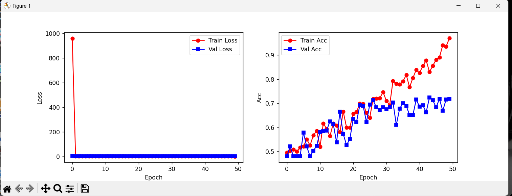
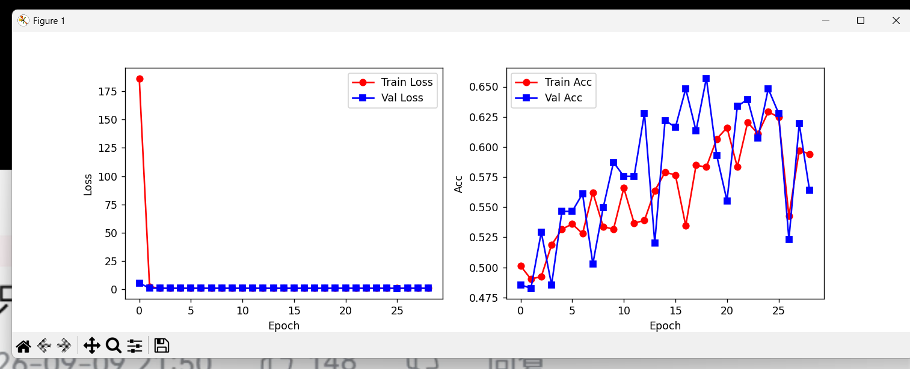
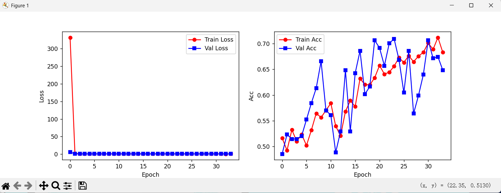
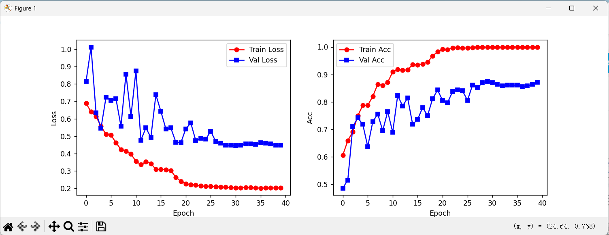
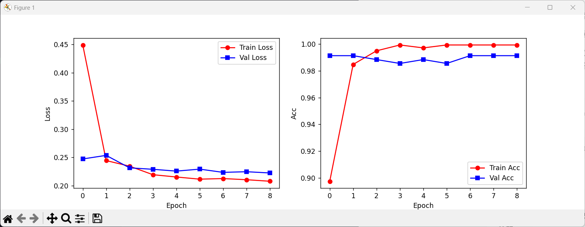
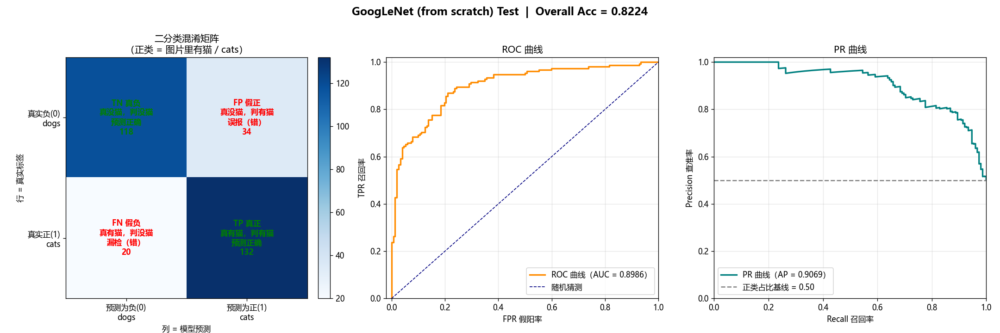
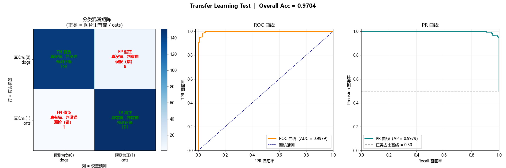

# GoogLeNet 猫狗图像分类实验报告

**课程/项目**：基于 GoogLeNet 的猫狗二分类对比实验
**实验内容**：从零手写 GoogLeNet 训练 vs. ImageNet 预训练迁移学习
**提交日期**：2026-09

---

## 摘要

本实验在猫狗二分类任务上，对比了**从零手写 GoogLeNet**与 **ImageNet 预训练迁移学习**两条技术路线。从零版经历数据增强、正则化调整、Batch Normalization 引入等五轮优化迭代，最终在测试集（共 304 张）上达到 **82.24%** 准确率；迁移学习版复用预训练特征并微调，准确率达 **97.04%**。结果表明：在小规模数据（训练 1721 张 / 测试 304 张）下，迁移学习显著优于从零训练，而数据规模本身是从零训练方案的精度上限，难以通过调参突破。

**关键词**：图像分类；GoogLeNet；迁移学习；数据增强；Batch Normalization；过拟合

---

## 1 引言

### 1.1 实验背景

猫狗二分类是图像分类领域最具代表性的入门基准任务。本实验选择 GoogLeNet 作为主干网络，原因有二：一是其 Inception 多尺度结构在参数量可控的前提下具备较强表达能力；二是通过手写实现可深入理解其模块设计与训练技巧。

### 1.2 实验目标

1. 从零实现 GoogLeNet 并完成训练，探究小数据场景下的训练稳定性与优化策略；
2. 引入 ImageNet 预训练权重进行迁移学习，与从零训练做对照；
3. 通过量化指标与可视化手段，分析两条路线的性能差异及其成因。

---

## 2 数据集与实验环境

### 2.1 数据集

数据按 `ImageFolder` 结构组织为训练集与测试集，实测各类别数量如下：

| 数据集 | cats | dogs | 合计 |
|--------|------|------|------|
| 训练集 `data/train` | 860 | 861 | 1721 |
| 测试集 `data/test` | 152 | 152 | 304 |

> **数据规模说明**：测试集每类仅 152 张（共 304 张），样本量相对有限。因此准确率的绝对数值存在一定统计波动，结论应以两方案的相对差距（约 15 个百分点）为主要依据。

### 2.2 实验环境

- 软件：Python（Anaconda 环境 `pytorch`），依赖 `torch` / `torchvision` / `matplotlib` / `numpy`；
- 硬件：CUDA 可用时自动启用 GPU，否则回退 CPU；
- 评估指标：整体准确率、每类 Precision / Recall / F1、混淆矩阵、ROC 曲线、PR 曲线。

### 2.3 数据预处理

- 从零版：使用训练集自身统计的均值/标准差做归一化（与训练时一致）；
- 迁移学习版：使用 ImageNet 统计常数归一化（与预训练权重匹配）。

---

## 3 方法

### 3.1 从零手写 GoogLeNet 及其优化演进

 baseline 版本（`197f95c`）手写实现 GoogLeNet，包含 Inception 模块与辅助分类器，采用 Adam 优化器（学习率 2e-3）、Dropout(0.5)，无数据增强。在此基础上进行五轮优化，提交记录如下：

| 阶段 | 提交号 | 核心改动 |
|------|--------|----------|
| 基线 init | `197f95c` | 手写 GoogLeNet（Inception + 辅助分类器）、Dropout(0.5)、Adam lr=2e-3、无增强 |
| 优化1 | `c431283` | 数据增强 + AdamW(wd=1e-4) + label smoothing(0.1) + ReduceLROnPlateau + EarlyStopping + 固定随机种子 |
| 优化2 | `f4e1db0` | 移除 Dropout、关闭 ColorJitter、权重衰减 1e-4→1e-5（松绑正则） |
| 优化3 | `30e8fad` | 全网络加入 Batch Normalization、学习率 2e-3→1e-3 |
| 优化4 | `4b6b009` | 引入迁移学习（见 3.2，新建 `model_transfer.py` / `train_transfer.py`） |
| 优化5 | `d851700` | 测试可视化：输出混淆矩阵 + ROC + PR 三子图与分类报告 |

> 代码级改动细节详见《模型演进报告.md》。

### 3.2 迁移学习路线

迁移学习版复用 `torchvision` 提供的 ImageNet 预训练 GoogLeNet 权重，替换最终分类头为 2 类输出。训练策略为：先冻结主干、仅训练新分类头，再解冻最后 3 个 Inception 模块并以分层学习率微调；冻结层在训练阶段保持 `eval()` 以固定其 BatchNorm 统计。该路线与从零版的关键差异在于**特征提取器起点**——前者从百万级图像上习得的通用视觉特征出发，而非随机初始化。

---

## 4 实验结果与分析

### 4.1 训练过程

各优化阶段的训练/验证损失与准确率曲线保存于 `result/`，以下逐一对照分析。

**图 1 基线（init）训练曲线**

基线版本无数据增强、仅以 Dropout 正则。曲线显示训练损失持续下降而验证指标明显滞后，训练/验证之间存在较大间隙，表明模型已出现**过拟合**——仅靠 Dropout 不足以在小数据上约束容量。

**图 2 优化1（数据增强 + 强正则）训练曲线**

引入数据增强与一整套正则（权重衰减、label smoothing）后，训练/验证间隙较基线收窄，说明增强有效提升了泛化能力。但较强的正则组合也拖慢了收敛，为后续松绑埋下伏笔。

**图 3 优化2（松绑正则）训练曲线**

优化2 撤销 Dropout 并将权重衰减由 1e-4 降至 1e-5。曲线显示验证指标较优化1 有所回升，印证「小网络 + 小数据」场景下正则强度需精细匹配——过强会滑向欠拟合，反而损害性能。

**图 4 优化3（加入 Batch Normalization）训练曲线**

全网络加入 Batch Normalization 后，损失曲线更加平滑、收敛更稳定，学习率得以降至 1e-3。BN 提供的内部协变量偏移校正，是从零版能够稳定训练的重要支撑。

**图 5 优化4（迁移学习）训练曲线**

迁移学习曲线与从零版形成鲜明反差：损失快速下降且验证准确率持续处于高位。预训练特征使模型在训练初期即具备判别能力，无需从像素级重新学习。

### 4.2 测试集性能

在测试集（304 张）上的整体与每类指标如下：

| 方案 | 测试准确率 | cats F1 | dogs F1 | 平均损失 |
|------|-----------|---------|---------|----------|
| 从零手写（最终） | 0.8224 | 0.8138 | 0.8302 | — |
| 迁移学习 | 0.9704 | 0.9697 | 0.9711 | 0.1471 |

> **评估口径说明**：测试脚本打印的分类报告中 `cats`/`dogs` 行标签顺序与混淆矩阵不一致，本报告以显式混淆矩阵为准还原各类指标，确保口径统一。

**从零版混淆矩阵与 ROC/PR（图 6）**

由混淆矩阵（正类 = cats）可见：真实 cats 152 张中 118 张正确、34 张误判为 dogs；真实 dogs 152 张中 132 张正确、20 张误判为 cats。即模型对**猫的召回偏低（118/152 ≈ 0.776）**，是把猫误判为狗导致精度受限的主因；ROC 与 PR 曲线下面积虽高于随机，但尾部仍有明显错分，与 82.24% 的准确率相互印证。

**迁移版混淆矩阵与 ROC/PR（图 7）**

迁移版混淆矩阵仅 9 张误判（1 张狗误报为猫、8 张猫漏判为狗），两类召回均高于 0.94，ROC/PR 曲线紧贴左上角，可视化结果与 97.04% 的准确率一致，说明预训练特征在该任务上几乎给出判别性解。

### 4.3 方法对比与成因分析

**为什么迁移学习远优于从零训练**：从零版需自行完成「边缘→纹理→部件→语义」的完整特征学习，1721 张训练图远不足以支撑如此复杂的映射；迁移版直接继承 ImageNet 通用特征，仅需对齐「猫狗判别」这一薄层语义，因而在有限数据下泛化更佳。

**各优化阶段对从零版的影响**：数据增强有效缓解过拟合（图 1→图 2 间隙收窄）；正则过强时需松绑以恢复收敛（图 2→图 3）；Batch Normalization 稳定了训练并允许更小学习率（图 4）。然而即便叠加全部优化，从零版仍停留在约 82%，进一步说明**数据规模是从零路线的硬约束**，调参收益有限。

---

## 5 讨论

### 5.1 数据规模的局限

本实验训练与测试样本均在「千」量级，尤其测试集每类仅 152 张。在此规模下，模型性能对数据分布与划分较为敏感，绝对准确率宜结合置信区间理解；迁移学习带来的约 15 个百分点提升，方向明确、可信度高。

### 5.2 训练策略中的偏差—方差权衡

优化1 一次性叠加增强、权重衰减、label smoothing 与 Dropout，反而压制了模型；优化2 主动松绑后才恢复。这一过程直观体现了偏差—方差权衡：正则过强引入高偏差（欠拟合），正则过弱叠加大数据则高方差（过拟合）。最终从零版采用「弱权重衰减 + 增强 + BN + 无 Dropout」作为平衡点。

### 5.3 实验可复现性

当前训练脚本仅保存验证集最优权重（`best_model.pth` / `best_model_transfer.pth`），未留存逐 epoch 的权重快照与超参日志，导致中途各轮模型无法事后复测。建议后续实验：①每个 epoch 或每 N 轮保存带编号的 checkpoint；②记录完整超参与随机种子；③将测试指标自动落盘为 `json`/`csv`，便于跨实验纵向对比。

### 5.4 可视化对结论的支撑作用

测试阶段的三子图（混淆矩阵 / ROC / PR）将单一准确率转化为「错在何处、整体区分度如何」的可读信息，是定位瓶颈（如本实验从零版猫类召回不足）的关键手段，应在后续实验中常态化。

---

## 6 结论与建议

### 6.1 结论

1. 小规模数据下，迁移学习（97.04%）显著优于从零训练（82.24%），差距约 15 个百分点；
2. 从零版的精度上限由数据规模决定，调参难以突破；
3. 数据增强、Batch Normalization 与恰当的正则强度，是从零版稳定训练并逼近上限的必要手段。

### 6.2 建议

1. **保存训练快照**：增加 epoch 级 checkpoint 与超参日志，保障可复现与事后复测；
2. **扩充测试集**：将 `data/test` 补足至每类 1000 张，使评估统计更稳健；
3. **指标落盘**：测试脚本自动写出结构化指标文件，支持跨实验对比；
4. **追求更高精度**：在迁移学习基础上尝试更强骨干（ResNet / EfficientNet）或更细致的数据清洗，而非回到从零训练。

---

## 附录

### A. 图表索引

| 图号 | 内容 | 文件 |
|------|------|------|
| 图1 | 基线训练曲线 | `result/model_control_train.png` |
| 图2 | 优化1 训练曲线 | `result/model1_train.png` |
| 图3 | 优化2 训练曲线 | `result/model2_train.png` |
| 图4 | 优化3 训练曲线 | `result/model3.train.png` |
| 图5 | 优化4（迁移）训练曲线 | `result/model4_train.png` |
| 图6 | 从零版测试可视化（混淆矩阵/ROC/PR） | `result/model_test.png` |
| 图7 | 迁移版测试可视化（混淆矩阵/ROC/PR） | `result/model_transfer_test.png` |

### B. 代码与权重索引

- 网络定义：`model.py`（手写 GoogLeNet）、`model_transfer.py`（迁移构建）
- 训练脚本：`model_train.py`、`train_transfer.py`
- 测试脚本：`model_test.py`、`model_test_transfer.py`
- 权重文件：`best_model.pth`（从零最终）、`best_model_transfer.pth`（迁移）
- 代码演进详解：《模型演进报告.md》
- Git 提交：`197f95c` → `c431283` → `f4e1db0` → `30e8fad` → `4b6b009` → `d851700`
